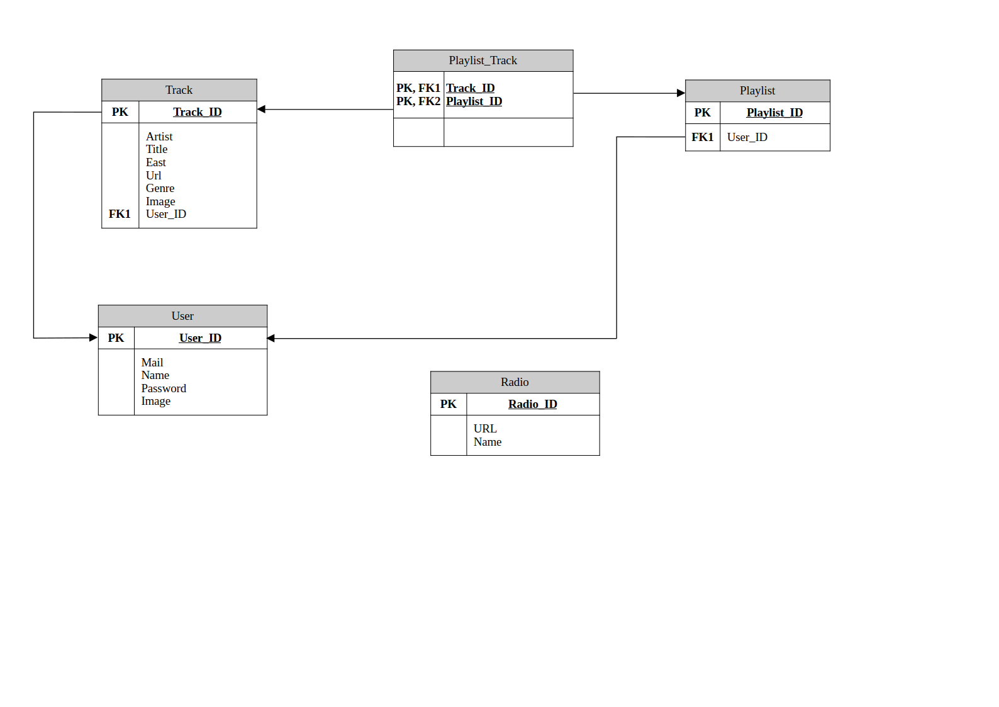

# Отчет по проектированию, анализу и улучшению архитектуры системы

## Теоретические сведения
На основе "Руководства Microsoft по моделированию приложений" (глава 2 «Основные принципы проектирования»), с учетом материалов из "Полезные ссылки" и лекционных слайдов.

## 1. Проектирование архитектуры "To Be"

### Для разрабатываемой системы:

1. **Тип приложения:** Разрабатываемое приложение является музыкальным стриминговым сервисом, позволяющим пользователям создавать и управлять плейлистами, слушать радиостанции и взаимодействовать с музыкальным контентом. Изначально приложение разрабатывается под Desktop, но планируется расширение под Android.

2. **Стратегия развёртывания:** Приложение будет развернуто с использованием локального сервера на ноутбуке, что обеспечит простоту настройки и тестирования. Данные будут храниться в облачном сервисе Dropbox и базе данных PostgreSQL. Приложение имеет распределленное развертывание.

3. **Выбор технологии:**
  - **Java**: Язык программирования, позволяющий создавать кроссплатформенные приложения.
  - **JavaFX**: Библиотека для разработки пользовательского интерфейса, обеспечивающая богатый функционал и удобное взаимодействие.
  - **PostgreSQL**: Надежная реляционная база данных с поддержкой сложных запросов и транзакций.
  - **Dropbox**: Облачное хранилище для хранения файлов и данных.

4. **Показатели качества:**
  - **Производительность**: Быстрое время загрузки и отклика.
  - **Надежность**: Обеспечение сохранности данных и устойчивость к сбоям.
  - **Удобство использования**: Интуитивно понятный интерфейс и простота навигации.
  - **Безопасность**: Защита личных данных пользователей.

5. **Реализация сквозной функциональности:** 
  - **Аутентификация пользователей**: Регистрация и вход в систему.
  - **Управление плейлистами**: Создание, редактирование и удаление плейлистов.
  - **Интеграция с радиостанциями**: Возможность прослушивания радиоканалов.
  - **Хранение данных**: Использование PostgreSQL для хранения информации о пользователях и контенте.

6. **Структурная схема приложения:**
Представленная структурная схема самого приложения.
  

## 2. Архитектруа "As Is"

В данной схеме мы представим структуру данных нашего музыкального стримингового сервиса, основанную на PostgreSQL. Важнейшими сущностями являются пользователи, треки и плейлисты, которые связаны между собой для создания единой экосистемы.

Ключевым элементом является связь между пользователями и плейлистами, обеспечивающая индивидуальный доступ к музыкальному контенту и возможность создания уникальных плейлистов. Понимание этой схемы — основа для дальнейшего развития приложения.

  
## 3. Сравнение и рефакторинг

### 1. Сравнение архитектур «As is» и «To be»

- **«As is»**: Архитектура на текущий момент включает основные классы для работы с пользователями и треками, но может иметь недостатки в модульности и расширяемости.
- **«To be»**: Предлагаемая архитектура включает четкое разделение на слои (UI, бизнес-логика, доступ к данным), что улучшает поддержку и масштабируемость приложения.

### 2. Отличия и анализ причин

- **Модульность**: В «To be» архитектуре добавлены дополнительные слои, что позволяет легче добавлять новые функции.
- **Управляемость**: Улучшена структура кода, что упрощает его поддержку.

### 3. Пути улучшения архитектуры

- **Использование паттернов проектирования**: Реализация паттерна MVC (Model-View-Controller) для разделения логики приложения.
- **Интеграция с REST API**: Для улучшения взаимодействия с внешними сервисами и обеспечения гибкости.
- **Документация**: Создание документации для кода и архитектуры для упрощения дальнейшей работы над проектом.

### Вывод

Проектирование архитектуры приложения — это ключевой этап, который определяет его структуру и возможности. На основе проведенного анализа, выявлены пути для улучшения архитектуры, что позволит создать более надежное и удобное в использовании приложение.
