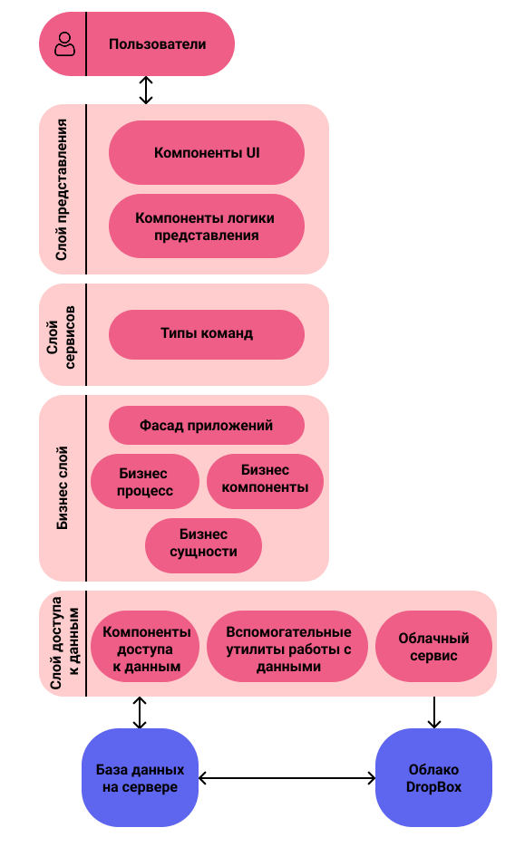

# Отчет по проектированию, анализу и улучшению архитектуры системы

## Теоретические сведения
На основе "Руководства Microsoft по моделированию приложений" (глава 2 «Основные принципы проектирования»), с учетом материалов из "Полезные ссылки" и лекционных слайдов.

## 1. Проектирование архитектуры "To Be"

### Для разрабатываемой системы:
1. **Тип приложения:** Разрабатываемое приложение является музыкальным стриминговым сервисом, позволяющим пользователям создавать и управлять плейлистами, слушать радиостанции и взаимодействовать с музыкальным контентом.
2. **Стратегия развёртывания:** Приложение будет развернуто с использованием локального сервера на ноутбуке, что обеспечит простоту настройки и тестирования. Данные будут храниться в облачном сервисе Dropbox и базе данных PostgreSQL.
3. **Выбор технологии:**
  - **Java**: Язык программирования, позволяющий создавать кроссплатформенные приложения.
  - **JavaFX**: Библиотека для разработки пользовательского интерфейса, обеспечивающая богатый функционал и удобное взаимодействие.
  - **PostgreSQL**: Надежная реляционная база данных с поддержкой сложных запросов и транзакций.
  - **Dropbox**: Облачное хранилище для хранения файлов и данных.
4. **Показатели качества:**
  - **Производительность**: Быстрое время загрузки и отклика.
  - **Надежность**: Обеспечение сохранности данных и устойчивость к сбоям.
  - **Удобство использования**: Интуитивно понятный интерфейс и простота навигации.
  - **Безопасность**: Защита личных данных пользователей.
5. **Реализация сквозной функциональности:** 
  - **Аутентификация пользователей**: Регистрация и вход в систему.
  - **Управление плейлистами**: Создание, редактирование и удаление плейлистов.
  - **Интеграция с радиостанциями**: Возможность прослушивания радиоканалов.
  - **Хранение данных**: Использование PostgreSQL для хранения информации о пользователях и контенте.
6. **Структурная схема приложения:**
  

## 2. Архитектруа "As Is"

## 3. Сравнение и рефакторинг

