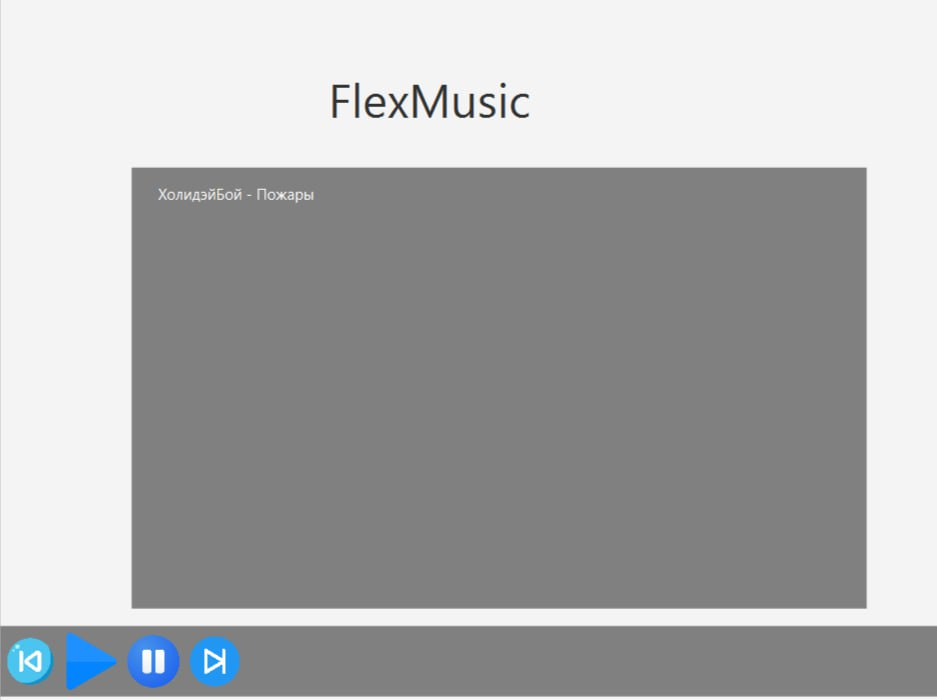
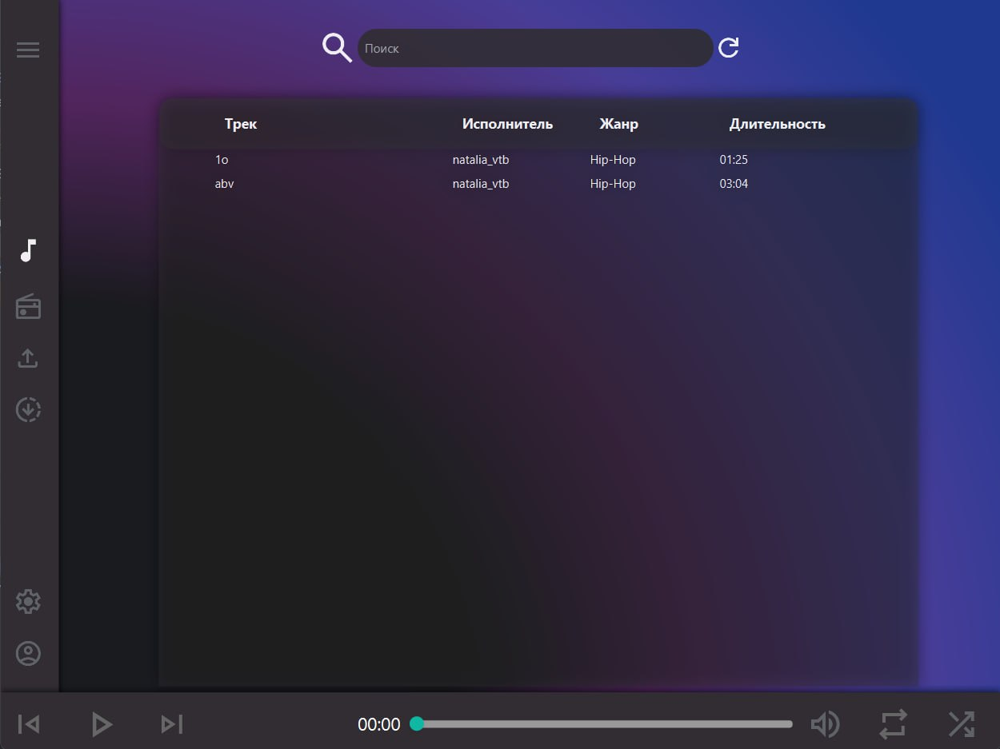
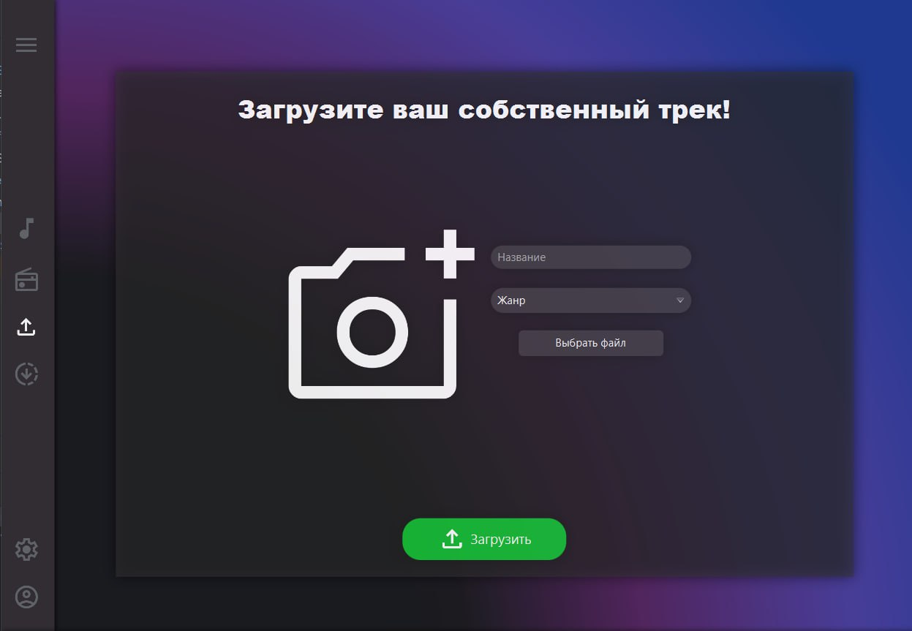
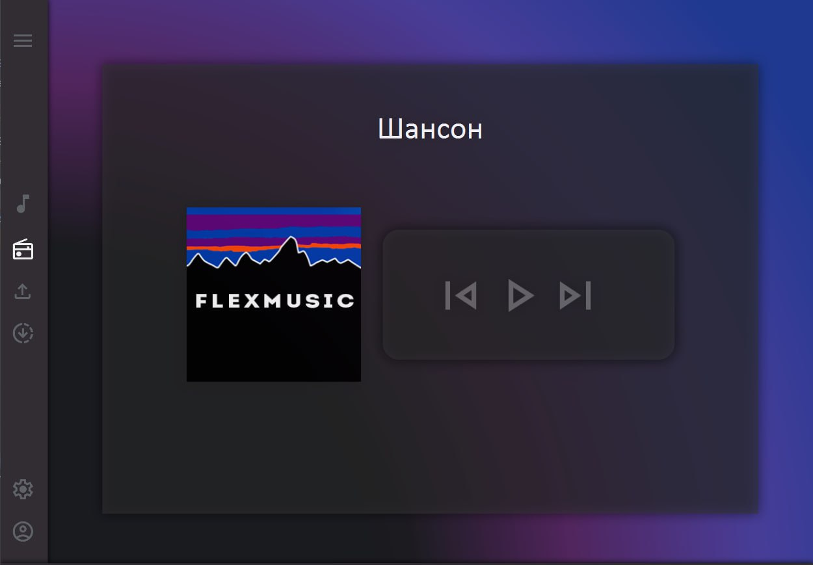
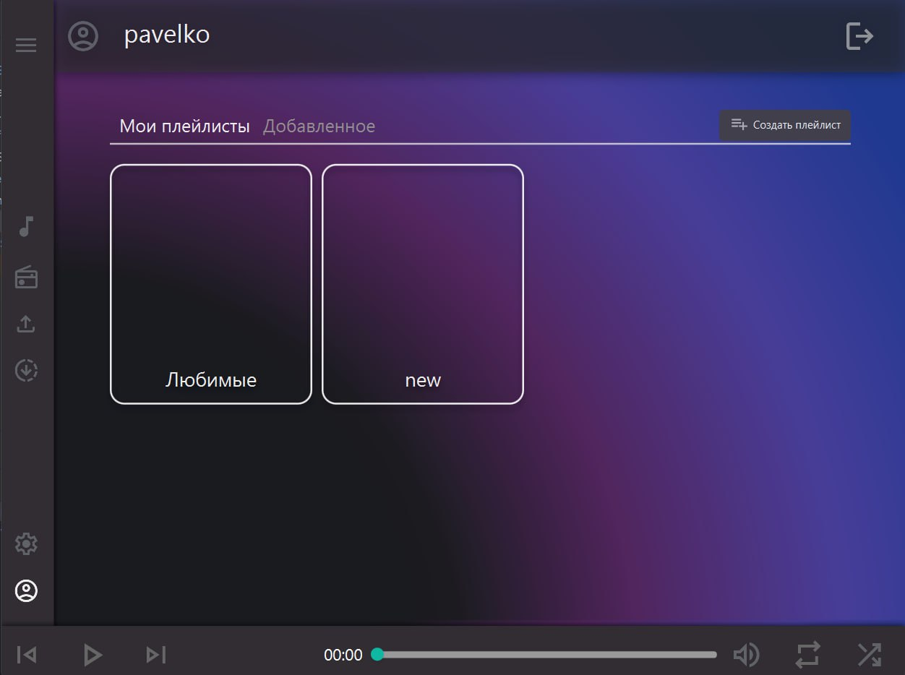

# Улучшение UX музыкальной платформы

## Оценка по атрибутам качества Usability (ISO/IEC 25010:2011)

### 1. Распознаваемость соответствия
**Оценка:** Средний уровень. Интерфейс понятен, но некоторые элементы управления неочевидны для новых пользователей.
**Улучшение:** Добавление подсказок, улучшение визуальной иерархии элементов.

### 2. Обучаемость
**Оценка:** Средний уровень. Интуитивность интерфейса на хорошем уровне, но есть сложные моменты в настройке плейлистов.
**Улучшение:** Введение интерактивного туториала, улучшение структуры настроек.

### 3. Используемость (операбельность)
**Оценка:** Хороший уровень, но есть задержки при загрузке большого количества треков.
**Улучшение:** Оптимизация производительности и кэширования данных.

### 4. Защита от ошибок пользователя
**Оценка:** Средний уровень. Возможны случайные удаления плейлистов без подтверждения.
**Улучшение:** Введение механизма "Отменить действие", подтверждения перед критическими изменениями.

### 5. Эстетика GUI
**Оценка:** Высокий уровень, но есть перегруженные экраны с большим количеством элементов.
**Улучшение:** Упрощение UI, более минималистичный дизайн, соответствие Material Design / Apple Human Interface Guidelines.

### 6. Доступность
**Оценка:** Низкий уровень. Нет поддержки для пользователей с ограниченными возможностями.
**Улучшение:** Внедрение поддержки экранных дикторов (ARIA), контрастных тем, клавиатурной навигации.

---

## Пути улучшения UX

1. **Упрощение интерфейса** – уменьшение перегруженности экранов, улучшение визуальной иерархии.
2. **Добавление онбординга** – интерактивные подсказки и обучающие экраны при первом входе.
3. **Оптимизация производительности** – ускорение загрузки треков, кэширование обложек альбомов.
4. **Поддержка доступности** – контрастные режимы, озвучивание элементов, удобная навигация с клавиатуры.
5. **Обновленный дизайн плеера** – современный внешний вид, удобные элементы управления.

---

## Улучшения "До и После"

### 🎵 **Пример 1: Улучшение списка плейлистов**
**До:** Слишком плотный интерфейс, трудно найти нужный плейлист.
**После:** Введение фильтров, улучшенный поиск, уменьшение количества элементов на странице.

### 🎶 **Пример 2: Оптимизация аудиоплеера**
**До:** Кнопки расположены неудобно, сложно переключаться между режимами.
**После:** Четкое разграничение зон управления, улучшенный дизайн, добавление жестов для мобильных устройств.

### 📢 **Пример 3: Улучшение системы уведомлений**
**До:** Навязчивые pop-up уведомления, нет истории действий.
**После:** Центр уведомлений, ненавязчивые всплывающие сообщения, история изменений.

---
### Первая версия приложения до

### Улучшенная версия после

## Заключение

Проведенные улучшения позволят сделать музыкальную платформу более удобной, быстрой и доступной для пользователей. Интеграция лучших практик UX-дизайна и тестирование с реальными пользователями помогут выявить дополнительные возможности для роста.
